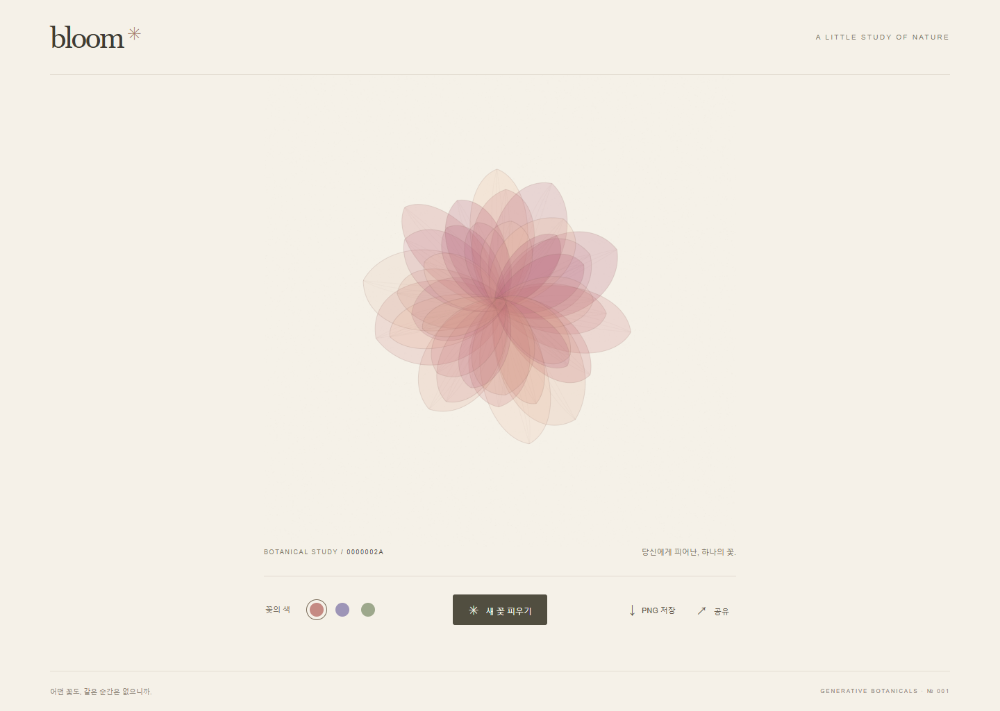
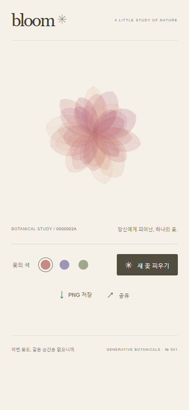

# Bloom

아이보리 종이 위에서 천천히 피어나는 생성형 디지털 꽃. Vite + TypeScript + Canvas 2D로 만들었으며 로그인, 서버, DB, 외부 AI API를 사용하지 않습니다.

[Bloom 열기](https://okorion.github.io/bloom/) · [재현 예시: seed 42 / 로즈](https://okorion.github.io/bloom/?v=1&seed=42&palette=rose)

## 실행과 검증

Node.js 22.12 이상과 npm을 사용합니다. CI는 Node.js 22를 사용합니다.

```sh
npm ci
npm run dev
# http://127.0.0.1:5173/bloom/

npm run lint
npm run typecheck
npm test
npm run build
npx playwright install chromium webkit
npm run test:e2e

npm run preview
# http://127.0.0.1:4173/bloom/
```

Linux에서 브라우저 의존성이 없으면 `npx playwright install --with-deps chromium webkit`을 사용합니다. `dist`가 정적 배포 결과물이며 preview 서버는 로컬 확인용입니다.

## 동작과 재현 계약

- 처음 방문하면 uint32 seed를 새로 만들고 URL에 기록합니다. 새 꽃은 현재 팔레트를 유지하며 seed를 변경합니다.
- 팔레트는 로즈(`rose`), 아이리스(`iris`), 세이지(`meadow`) 3종입니다. 팔레트만 바꾸면 꽃의 형태는 유지됩니다.
- URL 형식: `?v=1&seed=42&palette=rose`. seed는 0~4294967295의 십진 정수입니다. 잘못된 seed는 104729, 잘못된 팔레트는 rose로 복구합니다. 알 수 없는 버전은 기본 작품으로 복구합니다. 중복 매개변수는 첫 값을 사용하고 정규화합니다.
- `generateFlower(seed)`는 고정 난수 알고리즘으로 불변 꽃잎·종이 질감 데이터를 만듭니다. `renderFlower`는 해당 모델·팔레트·진행률만으로 그립니다. 리사이즈와 PNG 저장은 모델을 다시 생성하지 않습니다.
- 개화는 약 3초이며 새 작품 생성 시 이전 프레임을 취소하고 이전 콜백도 무효화합니다. reduced-motion에서는 즉시 완성합니다.
- PNG는 2048×2048, 아이보리 종이 배경 포함, UI·작품 번호 제외입니다. 개화 중에도 완성본을 저장하며 저장을 누른 시점의 작품을 사용합니다.
- 공유 API가 없거나 실패하면 클립보드를 사용하고, 복사가 막히면 선택 가능한 URL 입력란을 보여줍니다. 공유창 취소는 복사를 유발하지 않습니다.
- v1의 생성 규칙과 팔레트는 공유 링크의 계약입니다. 향후 형태·색 변경 시 새 버전을 추가하고 v1 렌더링을 보존해야 합니다.

## 배포

GitHub 저장소 Settings → Pages → Source를 **GitHub Actions**로 설정합니다. main push 시 `.github/workflows/pages.yml`이 lint, typecheck, 단위 테스트, build, Chromium/WebKit 테스트를 통과한 `dist`만 배포합니다. PR에서는 검증만 수행합니다.

이 저장소의 기본 주소는 `https://okorion.github.io/bloom/`이며 Vite base는 `/bloom/`입니다. 다른 경로에 배포할 때는 `vite.config.ts`의 base를 수정합니다. URL은 query string만 사용하므로 별도 SPA rewrite가 필요하지 않습니다. 문제 발생 시 이전 정상 커밋을 revert하여 동일 검증·배포 파이프라인으로 복구합니다.

## 검증 범위와 한계

- 단위 테스트 17개: 동일 seed·고정 기준값, 팔레트와 형태 분리, 1,000개 seed의 안전 여백, URL 오류·경계값, 오래된 애니메이션 콜백 무효화.
- Chromium/WebKit에서 각 6개, 총 12개 브라우저 테스트: URL 재접속, 팔레트 왕복, 리사이즈, 320/390px 모바일, 30회 연속 생성, 개화 중 PNG 저장과 동일 해상도 화면의 픽셀 일치, 공유 실패·취소·클립보드.
- 꽃의 형태와 팔레트는 재현됩니다. 브라우저·GPU·디스플레이별 안티앨리어싱과 색 표현은 미세하게 다를 수 있습니다. 화면 크기가 다른 경우 PNG와 축척이 다릅니다.
- 실제 iOS/Android 기기 및 네이티브 공유창은 실기기 검증하지 않았습니다. 모바일 뷰포트·WebKit 검증과 공유 API 모의 검증을 수행했습니다. PNG의 저장 위치와 표시 방식은 브라우저가 결정합니다.
- 저사양 기기에서는 개화 프레임이 줄어들 수 있습니다. 화면 DPR은 2로 제한하며 완성 후 반복 렌더링을 멈춥니다.

## 실제 화면

seed 42, 로즈, 완성 상태. 생성 이미지나 디자인 시안이 아닌 실행 중인 브라우저 캡처입니다.

| 데스크톱 | 모바일 |
| --- | --- |
|  |  |
